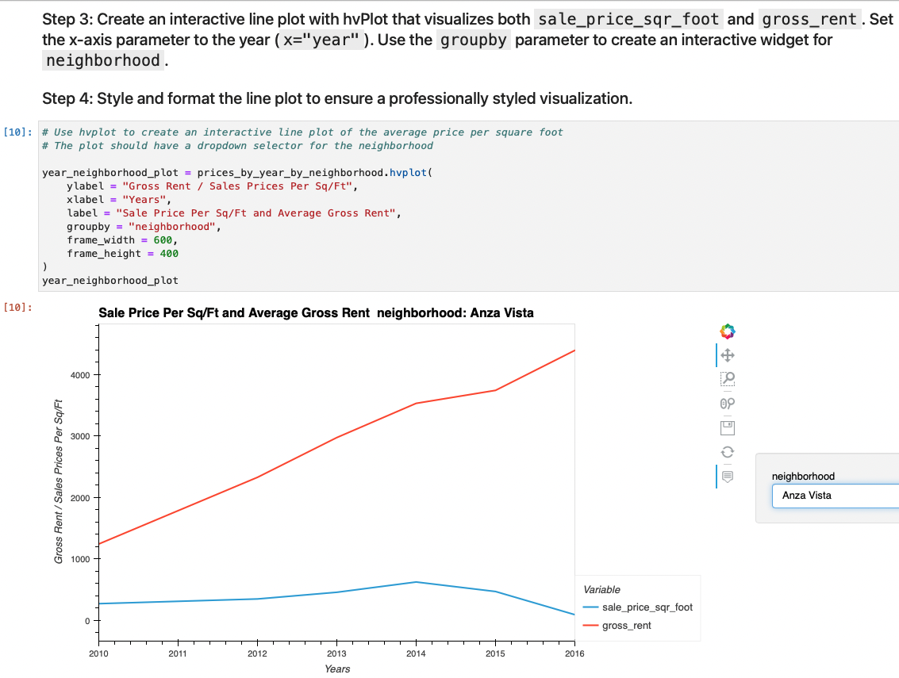
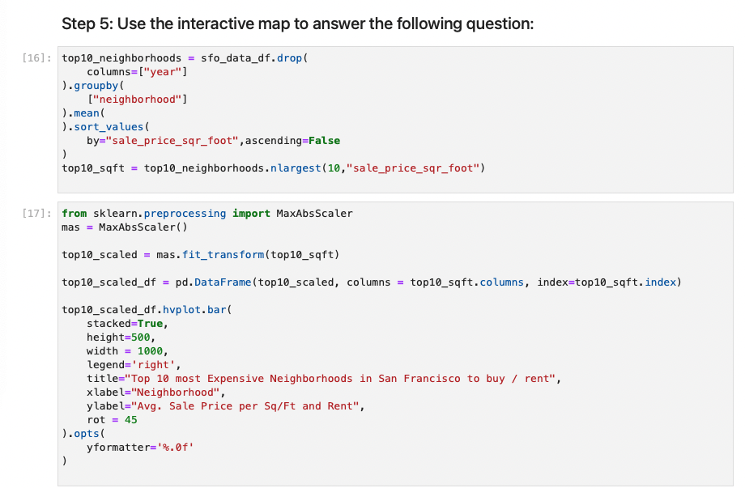

# Housing-Rental-Analysis-for-San-Francisco_HomeWork

My work can be found by clicking here: [Housing-rental Analysis for San Francisco](san_francisco_housing.ipynb)

>Starting the work with importing the libraries and dependencies, and after that we read and import the data into our jupyter notebook.

>Grouping by years we are able to see the changes in house units and plot using hvplot.bar()

>After that we are required to create a numerical aggregation by grouping the data by year and average the results.

>Question: 
What is the lowest gross rent reported for the years included in the DataFrame?

>Answer:
The lowest gross rent reported is approximately $1,239/month back in 2010. Since than we see a spike in rent prices, which in six years has quadrupled!
Meanwhile the price for square foot doesn't have the same rate of increase as the rent prices, in fact it has an increase by $328.30 which is almost 50% increase in 6-years!

## Compare the Average Sale Prices by Neighborhood

## Build an Interactive Neighborhood Map

## Step 4: Using hvPlot with GeoViews enabled, create a points plot for the all_neighborhoods_df DataFrame. Be sure to do the following:

## Step 5: Use the interactive map to answer the following question:

